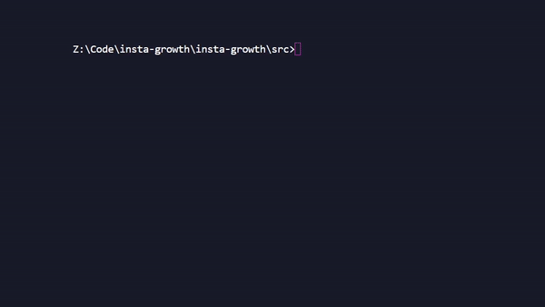
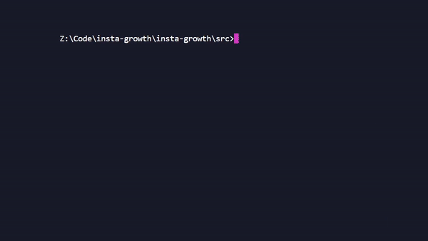
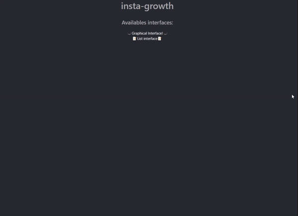
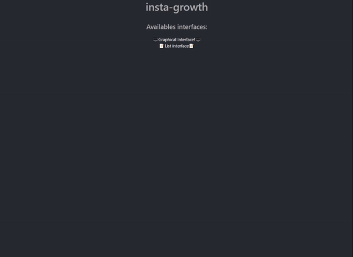

<p align=center>

  

  <br>
  <span><strong>insta-growth</strong> is a tool that facilitates the work when we try to realize the <a href="https://www.garyvaynerchuk.com/instagram-for-business-180-strategy-grow-business-brand/">$1.80 strategy</a></span><br />
 

<a href="http://girlazo.com"></a>

</p>


<p align="center">
  <a href="#installation">Installation</a>
  &nbsp;&nbsp;&nbsp;|&nbsp;&nbsp;&nbsp;
  <a href="#configuration">Configuration</a>
  &nbsp;&nbsp;&nbsp;|&nbsp;&nbsp;&nbsp;
    <a href="#usage">Usage</a>
      &nbsp;&nbsp;&nbsp;|&nbsp;&nbsp;&nbsp;
    <a href="#interface">Interface</a>
</p>


## Installation

**NOTE**: NodeJS 10.13.0 or higher is required.

```bash
# clone the repo
$ git clone https://github.com/EsteveSegura/insta-growth.git

# change the working directory to insta-growth
$ cd insta-growth

# install NodeJS & npm if they are not installed

# install the requirements
$ npm install
```


## Configuration 
Before running the software we have to add a minimum configuration to our project.

First we are going to create a file that contains our **username** and **password** on **instagram**, this file must be located at the **src folder** of our project and we must call it **.env**  
``./src/.env``

``` env
IG_USERNAME=InstagramAccount   
IG_PASSWORD=InstagramPassword
```

And then we have to fine tune the options with which we want the application to interact with **instagram**. This file is located in the **src folder** and is called **config.json** we can edit it with the most appropriate options.

``` json
{
    "hashtags" : ["food","recipes","sushi"], 
    "maxFollows" : 1000, 
    "maxMediaCount" : 450 
}
```
**hashtags :** hashtags related to our account.  
**maxFollows :** maximum followers of our targets.   
**maxMediaCount :** maximum media of our targets.  

## Usage
**Now we are ready to run the software**. Open two different terminals, we will execute two separate processes
``` bash
# Terminal 1
$ cd src
$ node server
```
<p align="center">
     
</p>

``` bash
# Terminal 2
$ cd src
$ node index
```

<p align="center">
     
</p>

These two processes belong to a web interface and the system that connects directly to instagram. We can interact directly with the web interface by browsing at <a href="http: //localhost:5000">http://localhost:5000</a>


## Interface
We can choose between two types of interface.  

- **Graphical interface**
This graphic interface is designed to be able to see in real time the photographs that the system is filtering for us.
<p align="center">
     
</p>

- **list interface**
This interface is simpler and only shows the links directly in list format, perfect if we want to use the system with a different account and then be able to use the links where we want
<p align="center">
     
</p>

## License
MIT © insta-growth
